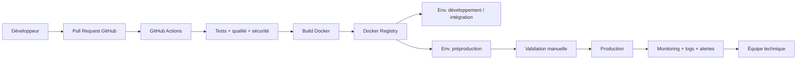
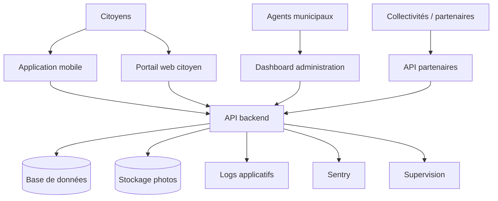
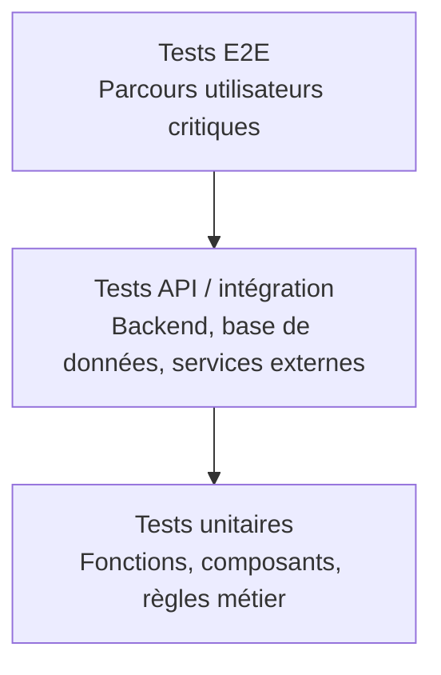
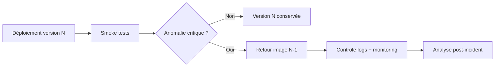

# Partie 2 — Mise en œuvre technique DevOps

## 1. Objectif de la partie

Cette partie présente la mise en œuvre technique de la démarche DevOps pour GreenCity Tech.

L’objectif est de passer d’un prototype fragile, déployé manuellement, à une plateforme :

- déployable automatiquement ;
- testée avant chaque mise en production ;
- observable en temps réel ;
- sécurisée dans sa chaîne de livraison ;
- capable de revenir rapidement à une version stable en cas d’incident ;
- structurée pour évoluer avec les besoins des collectivités.

L’idée n’est pas de créer une infrastructure trop complexe dès le départ, mais de poser des fondations techniques solides, progressives et adaptées à la taille de l’équipe.

---

## 2. Problèmes actuels et réponses techniques

| Problème actuel | Risque | Réponse DevOps proposée |
|---|---|---|
| Déploiements manuels sur VM | erreurs humaines, manque de traçabilité | pipeline CI/CD automatisé |
| Pas de préproduction stable | bugs découverts par les utilisateurs | environnement de préproduction proche de la production |
| Peu de tests automatisés | régressions fréquentes | tests unitaires, intégration, API et E2E |
| Pas de supervision claire | incidents détectés trop tard | supervision système + applicative + métier |
| Logs dispersés ou insuffisants | diagnostic lent | logs structurés puis centralisés |
| Pas d’IaC | infrastructure difficile à reproduire | Docker Compose, scripts versionnés, puis Terraform si besoin |
| Pas de rollback formalisé | interruption longue en cas de bug | images Docker versionnées + retour version précédente |

---

## 3. Architecture DevOps cible

### 3.1. Principe général

Le développeur ne doit plus déployer directement depuis son poste. Toute modification doit passer par Git, une revue de code, une chaîne de tests, puis un déploiement automatisé.

### 3.2. Composants de la plateforme

GreenCity Tech comprend plusieurs briques qui doivent être prises en compte dans la chaîne DevOps :

- application mobile citoyenne ;
- portail web citoyen ;
- dashboard d’administration municipale ;
- API backend ;
- base de données ;
- stockage des photos ;
- API partenaires pour les collectivités ;
- futurs modules : cartographie temps réel, photos HD, chatbot citoyen.

Ces évolutions futures ont aussi des impacts techniques qu’il faut anticiper dès la conception de l’architecture :

- les **photos HD** impliquent des besoins accrus en stockage, en compression, en gestion des coûts, en éventuelle modération de contenus et en vigilance RGPD ;
- la **cartographie temps réel** peut nécessiter une API plus performante, des mécanismes de cache et, selon les usages, du polling optimisé ou des échanges temps réel ;
- le **chatbot citoyen** suppose une attention particulière sur la journalisation, la sécurité, les données personnelles traitées et le suivi des erreurs ou comportements anormaux.

L’architecture DevOps proposée doit donc rester suffisamment simple au départ, tout en laissant la possibilité de renforcer progressivement les performances, l’observabilité et la sécurité à mesure que ces modules seront réellement intégrés.

Cette sobriété technique doit être assumée comme un choix d'architecture. Le recours à des services cloud plus managés ou à une plateforme d'orchestration plus avancée pourra être réévalué plus tard si la volumétrie, les exigences de disponibilité, le nombre de collectivités clientes ou les contraintes d'exploitation augmentent réellement.

### 3.3. Architecture applicative simplifiée

Point important : la CI/CD doit couvrir l’ensemble des composants, pas uniquement le backend. L’application mobile, le portail web, le dashboard et l’API ont tous besoin de contrôles qualité adaptés, même si le niveau d’automatisation n’est pas identique pour chacun.

Dans cette cible, la chaîne CI/CD couvre prioritairement le web, le dashboard et l’API. Pour le mobile, il est plus réaliste de prévoir au départ :

- des tests unitaires automatisés ;
- un build de validation si la stack le permet ;
- une recette manuelle structurée avant diffusion.

Il ne faut donc pas présenter la chaîne mobile comme identique à la chaîne web/backend. La publication sur stores, la signature applicative et les scénarios de test mobiles relèvent d'une industrialisation plus spécifique et plus progressive.

Ce choix doit être assumé comme un arbitrage de réalisme. Vouloir industrialiser immédiatement la chaîne mobile au même niveau que le web et le backend alourdirait fortement la mise en place, sans garantie d'un bon retour sur effort à ce stade. Il est donc plus crédible de sécuriser d'abord le socle principal, puis d'étendre progressivement l'automatisation mobile si l'usage et la complexité produit le justifient.

---

## 4. Environnements techniques

Je retiendrais trois environnements principaux.

| Environnement | Rôle | Déclenchement | Données |
|---|---|---|---|
| Développement / intégration | tester les branches fusionnées et valider l’intégration continue | automatique depuis `develop` | données fictives ou anonymisées |
| Préproduction | recette interne et client avant production | automatique ou semi-automatique depuis une release | données anonymisées, configuration proche prod |
| Production | environnement utilisé par les citoyens, collectivités et agents municipaux | validation manuelle obligatoire | données réelles |

### 4.1. Principes retenus

- séparation stricte des bases de données ;
- variables d’environnement différentes selon l’environnement ;
- secrets séparés entre dev, préprod et production ;
- préproduction proche de la production ;
- pas de données personnelles réelles en préproduction si ce n’est pas nécessaire ;
- monitoring activé sur préproduction et production.

### 4.2. Positionnement sur l'hébergement et le cloud

Le choix de VPS avec Docker reste cohérent au regard du contexte actuel :

- coût plus maîtrisé ;
- architecture plus simple à expliquer et à opérer ;
- niveau de complexité adapté à une équipe encore en phase de structuration ;
- meilleur alignement avec les compétences effectivement maîtrisées au démarrage.

Ce choix n'exclut pas une évolution ultérieure. Si GreenCity Tech devait absorber une charge beaucoup plus forte, renforcer la haute disponibilité ou industrialiser davantage l'exploitation, une trajectoire vers des services cloud plus managés pourrait alors être étudiée.

---

## 5. Pipeline CI/CD détaillé

L’objectif est de présenter une chaîne CI/CD détaillée, avec des étapes identifiables, plutôt qu’une description trop générale.

Il faut toutefois distinguer les contrôles rapides de pull request des tests plus complets, qui nécessitent parfois une application déjà buildée, une image Docker disponible, une base de données de test, des migrations et un environnement cohérent.

### 5.1. Pipeline global proposé

```mermaid
flowchart TB
    A[Développeur pousse une branche feature/*] --> B[Ouverture Pull Request]

    B --> C1[Stage PR - Install dependencies]
    C1 --> C2[Stage PR - Lint, format, type check]
    C2 --> C3[Stage PR - Tests applicatifs rapides]
    C3 --> C4[Stage PR - Security and accessibility checks]
    C4 --> C5{Code review validée ?}

    C5 --> D{Merge vers develop ?}
    D -->|Oui| E1[Stage Build - Build application]
    E1 --> E2[Stage Build - Build Docker images]
    E2 --> E3[Stage Build - Push images to registry]
    E3 --> E4[Stage Test env - Start test environment]
    E4 --> E5[Stage Test env - Init test database]
    E5 --> E6[Stage Test env - E2E web tests]
    E6 --> E7[Stage Dev - Deploy to dev/integration]
    E7 --> E8[Stage Dev - Smoke tests]

    E8 --> F{Release candidate ?}
    F -->|Oui| G1[Stage Preprod - Run DB migrations]
    G1 --> G2[Stage Preprod - Deploy to preprod]
    G2 --> G3[Stage Preprod - Full regression tests]
    G3 --> G4[Validation métier hors CI]

    G4 --> H{Production approval ?}
    H -->|Oui| I1[Stage Prod - Backup database]
    I1 --> I2[Stage Prod - Deploy production]
    I2 --> I3[Stage Prod - Smoke tests production]
    I3 --> I4[Stage Prod - Monitoring check]
    I4 --> I5{Incident critique ?}
    I5 -->|Non| J[Release terminée]
    I5 -->|Oui| K[Rollback version précédente]
```

### 5.2. Jobs exécutés sur Pull Request

Objectif : empêcher l’intégration de code instable.

| Job | Objectif | Exemple d’outil |
|---|---|---|
| Install dependencies | installer les dépendances de manière reproductible | npm ci / pnpm install --frozen-lockfile |
| Lint | détecter les erreurs de style et mauvaises pratiques | ESLint |
| Format check | vérifier le formatage du code | Prettier |
| Type check | vérifier les erreurs de typage | TypeScript |
| Tests applicatifs | tester les fonctions, composants et principaux cas unitaires/intégration rapides | Jest, Supertest, Newman selon la stack |
| Scan dépendances | détecter les vulnérabilités connues | Dependabot, npm audit, Snyk éventuellement |
| Contrôle accessibilité | détecter les régressions majeures sur le portail web | axe, Lighthouse ou équivalent |
| Revue de code | validation humaine avant fusion, en dehors des jobs automatiques | Pull Request GitHub |

### 5.3. Jobs exécutés après merge vers `develop`

Objectif : déployer automatiquement sur un environnement d’intégration.

| Job | Objectif |
|---|---|
| Build application | générer les builds nécessaires avant packagisation |
| Build images Docker | construire les images web, API, dashboard si séparées |
| Push registry | stocker les images versionnées |
| Environnement de test | démarrer les services nécessaires aux tests avancés |
| Base de données de test | appliquer migrations et initialisation de données |
| E2E web | exécuter Cypress sur un environnement cohérent |
| Deploy integration | déployer sur l’environnement dev/intégration |
| Smoke tests | vérifier rapidement que l’application répond correctement |
| Notification équipe | prévenir l’équipe en cas de succès ou d’échec |

### 5.4. Jobs exécutés pour une release candidate

Objectif : préparer la préproduction et la recette.

| Job | Objectif |
|---|---|
| Tests de non-régression complets | vérifier que les parcours critiques fonctionnent toujours |
| Migration BDD préprod | tester les migrations de base avant production |
| Déploiement préprod | mettre à disposition une version candidate |
| Vérifications finales | rejouer les parcours clés et contrôler l’environnement cible |
| Validation métier hors CI | permettre au PO / client de valider la version |

### 5.5. Jobs exécutés pour la production

Objectif : déployer de manière contrôlée.

| Job | Objectif |
|---|---|
| Validation manuelle | éviter un déploiement automatique non maîtrisé en production |
| Backup BDD | sécuriser un point de retour avant déploiement |
| Déploiement production | mettre en ligne l’image Docker validée |
| Smoke tests production | vérifier que les services principaux répondent |
| Monitoring renforcé | surveiller les erreurs et performances après release |
| Rollback | revenir à la version précédente si incident critique |

---

## 6. Tests de non-régression

### 6.1. Principe

Les tests de non-régression doivent vérifier que les fonctionnalités déjà validées continuent de fonctionner après chaque évolution.

Pour GreenCity Tech, il ne faut pas chercher à tout automatiser dès le départ. Il faut commencer par les parcours critiques, c’est-à-dire ceux qui bloquent réellement les citoyens ou les collectivités en cas de panne.

Il faut également rappeler que les tests E2E ou de non-régression avancés n'ont pas le même coût technique que les tests rapides de pull request. Ils nécessitent souvent une application déjà buildée, une base de données préparée et un environnement de test cohérent.

### 6.2. Parcours critiques à couvrir

| Parcours | Risque si régression |
|---|---|
| création d’un compte citoyen | impossibilité d’utiliser la plateforme |
| connexion utilisateur | blocage total de l’accès |
| création d’un signalement | perte de la fonction principale |
| ajout d’une photo | signalements incomplets |
| géolocalisation du signalement | incident mal positionné |
| consultation de la carte | mauvaise visibilité des incidents |
| traitement d’un signalement côté administration | blocage du suivi municipal |
| appel API partenaire | rupture d’intégration avec une collectivité |

### 6.3. Pyramide de tests proposée

### 6.4. Outils possibles

| Besoin | Outil |
|---|---|
| Tests unitaires | Jest / Vitest |
| Tests backend/API | Jest, Supertest, Postman/Newman |
| Tests E2E web | Cypress |
| Tests mobile | tests ciblés sur les parcours critiques |
| Qualité code | ESLint, TypeScript, SonarQube plus tard |

---

## 7. Sécurité de la chaîne de déploiement

### 7.1. Principes de sécurité retenus

- secrets jamais stockés dans Git ;
- variables sensibles stockées dans GitHub Secrets ou sur le serveur ;
- accès production limités aux personnes nécessaires ;
- validation manuelle obligatoire pour la production ;
- branches protégées ;
- pull requests obligatoires ;
- scans de dépendances ;
- scans des images Docker ;
- logs d’audit des déploiements ;
- sauvegarde avant les déploiements sensibles ;
- séparation stricte entre dev, préprod et production.

### 7.2. Outils possibles

| Besoin | Outil |
|---|---|
| Secrets CI/CD | GitHub Secrets |
| Détection vulnérabilités dépendances | Dependabot, npm audit |
| Scan image Docker | Trivy |
| Protection branches | GitHub branch protection rules |
| Audit déploiement | logs GitHub Actions + tags de release |
| Connexion serveur | SSH par clé, accès restreints |

---

## 8. Stratégie de déploiement et rollback

### 8.1. Déploiement court terme

Pour rester cohérent avec une petite structure, je proposerais d’abord :

- images Docker versionnées ;
- déploiement via Docker Compose ;
- conservation des dernières versions stables ;
- sauvegarde avant release majeure ;
- smoke tests après déploiement ;
- rollback documenté vers l’image précédente.

### 8.2. Rollback simple

### 8.3. Déploiement moyen terme

Si la plateforme prend de l’ampleur, on pourra envisager :

- blue/green deployment ;
- canary release ;
- feature flags ;
- orchestration plus avancée ;
- Kubernetes uniquement si le besoin réel apparaît.

---

## 9. Supervision

La supervision doit couvrir trois niveaux : système, applicatif et métier.

Cette distinction est importante, car elle évite de confondre plusieurs besoins différents. Une équipe peut surveiller correctement la consommation CPU et mémoire d'un VPS tout en restant aveugle sur les erreurs réellement subies par les utilisateurs. À l'inverse, des erreurs applicatives bien remontées ne suffisent pas si le serveur manque de ressources ou si la plateforme devient instable.

### 9.1. Supervision système

Objectif : savoir si l’infrastructure fonctionne correctement.

Indicateurs :

- CPU ;
- mémoire ;
- disque ;
- charge réseau ;
- disponibilité serveur ;
- disponibilité base de données.

Outil proposé au départ : **Netdata**.

Ce choix est volontairement pragmatique. Netdata permet d'obtenir rapidement une vue exploitable de la santé système sans imposer une stack d'observabilité plus lourde, donc plus coûteuse à installer, maintenir et interpréter pour une équipe encore en structuration.

En complément, un outil de supervision externe de disponibilité comme **UptimeRobot** ou un équivalent peut être ajouté. Son rôle n'est pas de remplacer la supervision interne, mais de vérifier depuis l'extérieur que le portail web et l'API restent réellement accessibles, que le certificat SSL est valide et que les temps de réponse restent acceptables.

### 9.2. Supervision applicative

Objectif : comprendre les erreurs rencontrées par les utilisateurs.

Indicateurs :

- erreurs backend ;
- erreurs frontend ;
- erreurs mobile ;
- exceptions ;
- endpoints en échec ;
- temps de réponse API ;
- version applicative concernée.

Outil proposé : **Sentry**.

Le recours à Sentry se justifie parce qu'il complète la supervision système plutôt qu'il ne la remplace. Netdata indique si l'infrastructure tient, tandis que Sentry permet de voir les erreurs applicatives réelles, les exceptions, les versions concernées et la fréquence des incidents observés côté utilisateur.

### 9.3. Supervision métier

Objectif : savoir si le service rendu fonctionne réellement.

Indicateurs :

- nombre de signalements créés ;
- taux d’échec lors de la création d’un signalement ;
- volume de photos envoyées ;
- temps moyen de traitement d’un incident ;
- taux d’erreur des API partenaires ;
- nombre de signalements en attente.

---

## 10. Gestion des logs

### 10.1. Court terme

Dans un premier temps :

- logs Docker accessibles ;
- logs backend structurés ;
- format JSON si possible ;
- horodatage ;
- niveaux de logs : info, warn, error ;
- rotation des logs ;
- conservation limitée ;
- correlation ID par requête.

### 10.2. Moyen terme

Quand le volume augmente :

- centralisation des logs ;
- recherche par endpoint, version, type d’erreur ;
- alertes sur pics d’erreurs ;
- outil possible : Loki + Grafana ou ELK.

### 10.3. Attention RGPD

Les logs ne doivent pas devenir une fuite de données personnelles.

Il faut donc garder une ligne simple :

- la supervision système sert à voir l'état des serveurs ;
- la supervision externe de disponibilité sert à vérifier ce que voit réellement un utilisateur ou un appel API depuis l'extérieur ;
- l'observabilité applicative sert à comprendre les erreurs réellement rencontrées ;
- les logs servent au diagnostic détaillé ;
- les alertes doivent rester ciblées sur les incidents critiques pour éviter le bruit.

Cette séparation rend la stratégie plus défendable qu'une approche où tous les sujets seraient mélangés dans un seul outil ou une seule promesse d'observabilité.

À éviter :

- mots de passe ;
- tokens ;
- données personnelles inutiles ;
- photos ou contenus sensibles ;
- coordonnées GPS complètes si non nécessaires au diagnostic.

---

## 11. Infrastructure as Code

### 11.1. Position retenue

L’IaC doit être introduite progressivement.

Pour GreenCity Tech, l’objectif n’est pas de déployer immédiatement une infrastructure cloud complexe, mais de rendre la configuration reproductible et documentée.

### 11.2. Ce qui peut être versionné

- configuration Docker Compose ;
- configuration reverse proxy ;
- scripts de déploiement ;
- configuration monitoring ;
- scripts de sauvegarde ;
- règles réseau simples ;
- variables non sensibles ;
- documentation d’installation serveur.

### 11.3. Outils proposés

| Période | Outil | Usage |
|---|---|---|
| Court terme | Docker Compose | décrire les services applicatifs |
| Moyen terme | Terraform | gérer l’infrastructure si l’hébergeur VPS ou l’architecture deviennent plus complexes |
| Option ultérieure | Ansible | automatiser davantage la configuration serveur si le besoin apparaît |

---

## 12. Outillage proposé

| Besoin | Outil retenu | Justification |
|---|---|---|
| Versioning | GitHub | centralisation du code, pull requests, branches protégées |
| CI/CD | GitHub Actions | intégré à GitHub, simple à mettre en place |
| Conteneurisation | Docker | environnements reproductibles |
| Déploiement | Docker Compose + SSH sécurisé | adapté à une petite infrastructure au départ |
| Registry | GitHub Container Registry ou Docker Hub privé | stockage des images versionnées |
| Qualité code | ESLint, Prettier, TypeScript | réduction des erreurs simples |
| Qualité avancée | SonarQube plus tard | dette technique, duplication, complexité |
| Tests unitaires | Jest / Vitest | validation rapide du code |
| Tests E2E | Cypress | parcours web critiques |
| Tests API | Supertest / Postman-Newman | validation backend et API collectivités |
| Sécurité dépendances | Dependabot, npm audit | détection vulnérabilités connues |
| Sécurité images Docker | Trivy | scan des images avant déploiement |
| Erreurs applicatives | Sentry | suivi des erreurs utilisateurs réelles |
| Supervision système | Netdata | rapide à mettre en place, adapté au VPS |
| Disponibilité externe | UptimeRobot ou équivalent | vérification externe du portail web, de l'API et des certificats |
| Logs | Docker logs puis Loki/Grafana | approche progressive |
| IaC | Docker Compose, Terraform si besoin, Ansible en option ultérieure | reproductibilité progressive |
| Documentation API | Swagger / OpenAPI | utile pour les collectivités partenaires |

---

## 13. Conclusion de la partie 2

La cible technique proposée permet à GreenCity Tech de fiabiliser la livraison logicielle sans surdimensionner l’infrastructure.

Les priorités sont :

1. automatiser les contrôles qualité ;
2. rendre les déploiements reproductibles ;
3. sécuriser la production ;
4. observer l’état réel du service ;
5. permettre un rollback rapide en cas d’incident.
