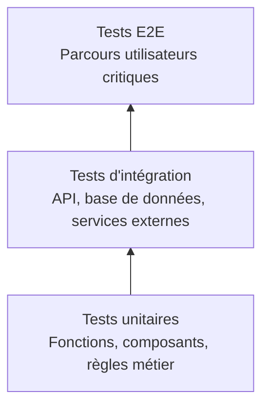

# Partie 3 — Qualité, conformité et sécurité applicative

## 1. Objectif de la partie

Cette partie présente la stratégie qualité, conformité et sécurité applicative proposée pour GreenCity Tech.

Après avoir structuré l'organisation DevOps et la mise en œuvre technique, l'objectif est de s'assurer que les fonctionnalités livrées sont réellement :

- fiables pour les citoyens et les collectivités ;
- testées avant leur mise en production ;
- sécurisées dans leur conception ;
- conformes aux contraintes web, mobile et RGPD ;
- accessibles au plus grand nombre ;
- exploitables et maintenables dans le temps.

La qualité ne doit pas être contrôlée uniquement à la fin du projet. Elle doit être intégrée dans tout le cycle de développement : cadrage du besoin, développement, tests, revue de code, recette, déploiement et suivi en production.

GreenCity Tech manipule plusieurs éléments sensibles ou critiques :

- comptes citoyens ;
- signalements urbains ;
- photos ;
- données de géolocalisation ;
- données consultées par les agents municipaux ;
- API partenaires utilisées par les collectivités ;
- futurs échanges possibles avec un chatbot citoyen.

La qualité ne se limite donc pas à éviter les bugs. Elle doit aussi garantir la sécurité des données, la conformité réglementaire, l'accessibilité et la continuité du service.

Cette partie prolonge directement les parties précédentes :

- la partie 1 a défini l'organisation, les responsabilités et les critères de validation ;
- la partie 2 a défini la chaîne CI/CD, les environnements, les déploiements, la supervision et l'observabilité ;
- la partie 3 précise comment garantir que le produit livré est non seulement déployable, mais aussi fiable, conforme, sécurisé et réellement utilisable.

---

## 2. Définition de la qualité attendue

### 2.1. Qualité fonctionnelle

La qualité fonctionnelle consiste à vérifier que la plateforme répond correctement aux besoins métier.

Pour GreenCity Tech, cela signifie notamment que :

- un citoyen peut créer un compte ;
- un citoyen peut se connecter ;
- un citoyen peut créer un signalement ;
- une photo peut être ajoutée au bon signalement ;
- la géolocalisation est correctement associée à l'incident ;
- une collectivité peut consulter les signalements ;
- un agent municipal peut modifier le statut d'un incident ;
- les API partenaires répondent correctement aux collectivités connectées.

L'enjeu principal est de protéger les parcours critiques. Une régression sur une fonctionnalité secondaire peut être gênante, mais une régression sur la création ou le traitement d'un signalement remet directement en cause la valeur du produit.

### 2.2. Qualité technique

La qualité technique concerne la capacité de l'équipe à maintenir et faire évoluer la plateforme.

Elle repose sur plusieurs principes :

- code relu avant intégration ;
- architecture compréhensible ;
- dette technique suivie ;
- règles de développement communes ;
- tests automatisés ;
- logs exploitables ;
- documentation minimale à jour ;
- erreurs applicatives surveillées.

L'objectif n'est pas d'atteindre une perfection technique immédiate, mais d'éviter que le prototype initial devienne de plus en plus difficile à corriger et à faire évoluer.

### 2.3. Qualité d'usage

La qualité d'usage consiste à vérifier que le service est réellement utilisable par les citoyens, les agents municipaux et les collectivités.

Elle implique :

- des parcours simples ;
- des interfaces compréhensibles ;
- des messages d'erreur clairs ;
- une bonne lisibilité ;
- une navigation adaptée au mobile ;
- des temps de réponse acceptables ;
- une accessibilité suffisante pour les publics variés.

Dans le cas d'une application citoyenne, l'ergonomie est particulièrement importante. Les utilisateurs ne sont pas forcément des profils techniques. Le parcours de signalement doit donc être court, clair et tolérant aux erreurs.

### 2.4. Qualité d'exploitation

La qualité d'exploitation concerne la capacité de l'équipe à maintenir le service en condition opérationnelle.

Elle suppose :

- des déploiements tracés ;
- une supervision active ;
- des logs structurés ;
- des alertes utiles ;
- une procédure de rollback ;
- des sauvegardes contrôlées ;
- une documentation d'exploitation minimale.

Une plateforme peut être fonctionnelle en développement mais difficile à exploiter en production. L'objectif est donc de rendre le service observable, réversible et maintenable.

### 2.5. Qualité des données

La qualité des données est importante car les collectivités vont s'appuyer sur les signalements pour organiser leurs interventions.

Points à contrôler :

- cohérence des statuts de signalement ;
- absence de doublons évidents ;
- géolocalisation suffisamment précise ;
- rattachement correct des photos au bon incident ;
- historisation des changements de statut ;
- traçabilité des actions réalisées par les agents municipaux.

Une application peut être techniquement stable tout en produisant des données inexploitables. Dans le cas de GreenCity Tech, la qualité logicielle et la qualité des données doivent donc être pensées ensemble.

---

## 3. Stratégie de tests

### 3.1. Principe général

Les tests doivent être organisés selon une logique progressive. GreenCity Tech ne doit pas chercher à tout automatiser dès le départ, mais à sécuriser en priorité les parcours les plus critiques.

La stratégie proposée repose sur quatre niveaux :

- tests unitaires ;
- tests d'intégration ;
- tests end-to-end ;
- recette manuelle structurée.

Cette approche permet d'obtenir rapidement un meilleur niveau de confiance sans bloquer l'équipe dans une stratégie de test trop lourde à maintenir.

### 3.2. Pyramide de tests



Les tests unitaires sont les plus nombreux car ils sont rapides et simples à exécuter. Les tests d'intégration vérifient les interactions entre composants. Les tests E2E sont moins nombreux, mais ils protègent les parcours utilisateurs essentiels.

### 3.3. Tests unitaires

Les tests unitaires permettent de valider des fonctions ou composants isolés.

Exemples pour GreenCity Tech :

- validation d'un formulaire de signalement ;
- contrôle du format d'une photo ;
- validation des coordonnées GPS ;
- calcul ou changement du statut d'un incident ;
- règles de droits selon le rôle utilisateur ;
- formatage des données envoyées à une API partenaire.

Outils possibles :

- Jest ;
- librairie de tests adaptée à la stack front ou mobile selon la technologie retenue.

### 3.4. Tests d'intégration

Les tests d'intégration vérifient que plusieurs composants fonctionnent correctement ensemble.

Exemples :

- création d'un signalement en base de données ;
- upload d'une photo et association au bon incident ;
- récupération des signalements par une collectivité ;
- authentification d'un utilisateur ;
- appel à une API partenaire ;
- modification du statut d'un incident par un agent municipal.

Ces tests sont importants car beaucoup d'anomalies apparaissent non pas dans une fonction isolée, mais dans les échanges entre l'application, l'API, la base de données et les services externes.

### 3.5. Tests end-to-end

Les tests end-to-end simulent des parcours proches de l'usage réel.

Parcours prioritaires :

| Parcours | Objectif |
|---|---|
| Inscription / connexion | vérifier l'accès au service |
| Création d'un signalement | protéger la fonctionnalité principale |
| Ajout d'une photo | vérifier la transmission des preuves visuelles |
| Géolocalisation | vérifier la position de l'incident |
| Consultation de la carte | vérifier la visibilité des incidents |
| Traitement municipal | vérifier le suivi côté administration |
| Suivi citoyen | vérifier la consultation du statut |
| API partenaire | vérifier l'intégration collectivité |

Outil retenu : **Cypress** pour les parcours web critiques.

Pour le mobile, il est plus réaliste de commencer par :

- des tests unitaires ;
- un build de validation si la stack le permet ;
- une recette manuelle structurée ;
- puis une automatisation progressive de certains parcours si le besoin et le budget le justifient.

### 3.6. Recette manuelle structurée

Les tests automatisés doivent être complétés par une recette manuelle structurée.

Cette recette est particulièrement utile pour :

- l'application mobile ;
- les tests multi-navigateurs ;
- l'ergonomie ;
- les permissions téléphone ;
- la caméra ;
- la géolocalisation ;
- les cas de réseau faible ;
- les comportements difficiles à automatiser au départ.

La recette doit être formalisée dans un cahier simple : scénario, prérequis, étapes, résultat attendu, statut et commentaire.

L'objectif n'est pas de remplacer les tests automatisés, mais de couvrir les zones où l'automatisation serait trop coûteuse ou peu fiable au démarrage.

---

## 4. Definition of Done et critères d'acceptation

### 4.1. Definition of Done

Une fonctionnalité ne doit pas être considérée comme terminée simplement parce que le code est écrit.

Je proposerais la Definition of Done suivante :

- le besoin est compris et validé ;
- les critères d'acceptation sont définis ;
- le code est développé ;
- les tests unitaires utiles sont écrits ;
- les tests d'intégration passent si la fonctionnalité touche l'API ou la base de données ;
- la pull request est relue ;
- la CI est verte ;
- la documentation utile est mise à jour ;
- les impacts sécurité ou RGPD sont vérifiés si nécessaire ;
- la fonctionnalité est testée en préproduction ;
- le Product Owner valide le comportement attendu.

Cette règle permet d'éviter qu'une fonctionnalité soit livrée trop tôt, sans validation suffisante.

Cette Definition of Done complète directement la stratégie DevOps décrite dans les parties précédentes. Elle transforme les principes de qualité, de sécurité et de recette en conditions concrètes de livraison.

### 4.2. Critères d'acceptation

Chaque user story doit disposer de critères d'acceptation clairs.

Ces critères permettent :

- de clarifier le besoin avant développement ;
- d'éviter les interprétations différentes entre métier et technique ;
- de faciliter la recette ;
- de déterminer objectivement si la fonctionnalité est terminée.

### 4.3. Exemple sur le signalement citoyen

Exemple de user story :

```md
En tant que citoyen,
je veux signaler un problème urbain,
afin que ma collectivité puisse le traiter.
```

Critères d'acceptation :

- l'utilisateur peut saisir un titre, une description et une catégorie ;
- l'utilisateur peut ajouter une photo ;
- la position GPS est associée au signalement ;
- le signalement apparaît dans le dashboard municipal ;
- l'utilisateur peut suivre le statut du signalement ;
- une erreur claire est affichée si l'envoi échoue ;
- aucune donnée sensible inutile n'est exposée dans les logs.

Cette approche permet de relier la qualité fonctionnelle, la qualité technique et la sécurité dès la phase de cadrage.

---

## 5. Sécurité applicative et données personnelles

### 5.1. Principes de sécurité applicative

La sécurité applicative doit être pensée dès la conception des fonctionnalités.

Principes retenus :

- authentification sécurisée ;
- gestion claire des rôles ;
- contrôle d'accès côté backend ;
- validation des entrées utilisateur ;
- protection contre les injections ;
- limitation du nombre de requêtes sur les API sensibles ;
- journalisation des actions importantes ;
- chiffrement HTTPS ;
- stockage sécurisé des fichiers ;
- séparation stricte entre environnements ;
- aucune donnée sensible dans le code ou les logs.

Ces principes complètent la sécurité déjà intégrée dans la chaîne de déploiement :

- `GitHub Secrets` pour les secrets CI/CD ;
- `Dependabot` et `npm audit` pour les dépendances ;
- `Trivy` pour l'analyse des images Docker ;
- protections de branches et validation manuelle pour les mises en production ;
- `Sentry` et les logs structurés pour aider à détecter les comportements anormaux.

Autrement dit, la sécurité ne se limite ni à l'application seule, ni au pipeline seul. Elle doit être cohérente de bout en bout.

Une revue périodique des droits, des dépendances critiques et des données conservées doit également être prévue afin d'éviter que les risques s'accumulent silencieusement dans le temps.

### 5.2. Gestion des rôles et permissions

La plateforme doit distinguer plusieurs types d'utilisateurs :

| Rôle | Droits principaux |
|---|---|
| Citoyen | créer et suivre ses signalements |
| Agent municipal | consulter et traiter les signalements de sa collectivité |
| Administrateur | gérer les comptes, paramètres et droits |
| Partenaire API | accéder uniquement aux données autorisées via API |

Le contrôle des permissions doit être réalisé côté backend, et pas uniquement dans l'interface. Même si un bouton est masqué côté front, l'API doit continuer à vérifier que l'utilisateur a réellement le droit d'effectuer l'action.

### 5.3. Données personnelles et RGPD

GreenCity Tech peut traiter plusieurs données personnelles :

- identité ou compte citoyen ;
- adresse email ;
- téléphone éventuel ;
- géolocalisation ;
- photos ;
- historique des signalements ;
- échanges avec un futur chatbot.

Les principes RGPD à appliquer sont :

- collecter uniquement les données nécessaires ;
- expliquer clairement l'usage des données ;
- demander les permissions nécessaires pour la géolocalisation et la caméra ;
- définir une durée de conservation ;
- permettre la suppression ou l'anonymisation lorsque c'est nécessaire ;
- limiter l'accès aux données aux personnes autorisées ;
- éviter les données personnelles dans les logs ;
- utiliser des données fictives ou anonymisées en préproduction.

Il faut également prévoir, même de façon simple au départ :

- une information claire dans la politique de confidentialité ;
- un point de contact pour les demandes liées aux données personnelles ;
- une traçabilité minimale des traitements sensibles ;
- une revue régulière des données réellement conservées.

### 5.4. Cas particulier des photos

Les photos sont un élément important du produit, mais aussi un point de risque.

Elles peuvent contenir :

- des visages ;
- des plaques d'immatriculation ;
- des lieux privés ;
- des métadonnées EXIF ;
- des coordonnées GPS ;
- des informations non nécessaires au traitement de l'incident.

L'ajout futur de photos HD augmente encore ces enjeux.

Mesures proposées :

- limiter la taille maximale des fichiers ;
- compresser ou redimensionner les images si nécessaire ;
- supprimer les métadonnées EXIF inutiles ;
- stocker les photos dans un espace dédié ;
- contrôler les droits d'accès aux fichiers ;
- prévoir une durée de conservation ;
- surveiller le volume de stockage ;
- envisager une modération si des abus apparaissent.

L'ajout de photos HD n'est donc pas seulement une évolution fonctionnelle. C'est aussi un sujet de stockage, de coût, de performance, de modération et de protection des données.

### 5.5. Sécurité des API partenaires

Les API partenaires permettent aux collectivités ou à des services tiers d'échanger avec GreenCity Tech.

Elles doivent être protégées par :

- authentification par clé API, OAuth ou mécanisme équivalent ;
- permissions limitées selon le partenaire ;
- rate limiting ;
- journalisation des appels sensibles ;
- documentation OpenAPI / Swagger ;
- versioning des endpoints ;
- validation stricte des entrées ;
- réponses d'erreur standardisées.

L'objectif est d'éviter qu'un partenaire puisse accéder à des données qui ne concernent pas sa collectivité ou perturber le service par des appels trop nombreux.

La qualité de ces API doit être suivie à la fois sous l'angle technique et sous l'angle sécurité :

- disponibilité ;
- temps de réponse ;
- taux d'erreur ;
- volume d'appels ;
- erreurs d'authentification ;
- tentatives d'accès non autorisées.

---

## 6. Conformité web, mobile et accessibilité

### 6.1. Conformité web

Le portail citoyen et le dashboard municipal doivent respecter des exigences minimales de qualité web.

Points à contrôler :

- responsive design ;
- compatibilité avec les navigateurs principaux ;
- performance des pages ;
- formulaires compréhensibles ;
- messages d'erreur clairs ;
- navigation clavier ;
- contrastes suffisants ;
- textes alternatifs pour les images utiles ;
- absence de blocage sur les lecteurs d'écran.

### 6.2. Conformité mobile

L'application mobile doit respecter les contraintes propres aux stores et aux usages mobiles.

Points à prévoir :

- respect des règles App Store et Google Play ;
- permissions explicites pour la caméra ;
- permissions explicites pour la géolocalisation ;
- explication claire de l'usage de ces permissions ;
- gestion des refus de permission ;
- compatibilité avec plusieurs tailles d'écran ;
- comportement acceptable en réseau faible ;
- suivi des crashs ;
- recette avant publication.

Une attention particulière doit être portée à la géolocalisation et à la caméra, car ce sont des permissions sensibles pour l'utilisateur.

Dans la continuité de la partie 2, la stratégie qualité mobile reste volontairement progressive :

- tests unitaires automatisés ;
- build de validation si possible dans la CI ;
- suivi des crashs ;
- recette manuelle avant diffusion ;
- montée en automatisation seulement si le besoin devient suffisamment fort.

Cette progressivité doit être explicitement justifiée. Le mobile implique des contraintes particulières : signature, diffusion sur stores, diversité des terminaux, gestion du réseau mobile et scénarios de test plus coûteux à automatiser. Il serait donc peu crédible de promettre dès le départ un niveau d'automatisation équivalent au web et au backend si l'équipe ne maîtrise pas encore ces chaînes en profondeur.

### 6.3. Accessibilité citoyenne

GreenCity Tech est une plateforme citoyenne. Elle doit donc être utilisable par des profils variés :

- personnes âgées ;
- personnes avec troubles visuels ;
- utilisateurs peu à l'aise avec le numérique ;
- utilisateurs sur mobile ;
- utilisateurs avec connexion instable ;
- personnes utilisant un lecteur d'écran ou un zoom important.

Mesures proposées :

- parcours de signalement court ;
- langage simple ;
- boutons visibles ;
- contrastes suffisants ;
- taille de texte adaptable ;
- navigation claire ;
- messages d'erreur compréhensibles ;
- compatibilité clavier et lecteur d'écran pour le web ;
- éviter les informations uniquement portées par la couleur.

Le référentiel RGAA peut servir de base pour cadrer l'accessibilité web, sans forcément viser une conformité exhaustive dès la première étape.

Il faut aussi préciser qu'un contrôle automatisé ne suffit pas à garantir seul l'accessibilité. Les outils automatiques permettent de détecter une partie des défauts techniques, mais la compréhension réelle des parcours, la lisibilité des messages et le confort d'usage doivent aussi être vérifiés humainement. C'est précisément pour cela que l'accessibilité doit être traitée comme une exigence de conception et de recette, pas seulement comme un scan de CI.

### 6.4. Performance et expérience utilisateur

La performance fait partie de la qualité perçue.

Points à surveiller :

- temps de chargement du portail ;
- temps de réponse API ;
- temps d'envoi d'un signalement ;
- temps d'upload photo ;
- fluidité de la carte ;
- comportement en réseau mobile faible ;
- taille des images envoyées.

Une application citoyenne lente ou instable risque d'être abandonnée, même si elle est fonctionnellement complète.

La performance doit donc être observée comme un critère de qualité à part entière, et pas seulement comme un sujet d'infrastructure :

- une API correcte techniquement mais trop lente dégrade le service ;
- une carte trop lourde ou un upload photo trop long réduit l'usage ;
- une mauvaise gestion du réseau mobile affaiblit l'intérêt de l'application sur le terrain.

---

## 7. Indicateurs qualité, sécurité et conformité

Il faut suivre un nombre limité d'indicateurs utiles, plutôt qu'un tableau de bord trop dense.

L'idée n'est pas de répéter tous les KPI DevOps déjà mentionnés dans les parties précédentes, mais de compléter ce pilotage avec des indicateurs davantage centrés sur la qualité livrée, la conformité et l'expérience réelle des utilisateurs.

### 7.1. Indicateurs qualité logicielle

- taux de réussite des tests ;
- couverture de tests ;
- nombre de bugs détectés en préproduction ;
- nombre de bugs détectés en production ;
- nombre de régressions sur parcours critiques ;
- dette technique suivie ;
- taux de pull requests validées sans correction majeure.

### 7.2. Indicateurs sécurité

- nombre de vulnérabilités critiques ouvertes ;
- délai moyen de correction des vulnérabilités ;
- nombre de dépendances obsolètes ;
- nombre d'incidents de sécurité ;
- nombre de secrets détectés dans le dépôt ;
- nombre d'anomalies de permissions détectées.

### 7.3. Indicateurs conformité et accessibilité

- score d'accessibilité ;
- nombre de retours utilisateurs liés à l'ergonomie ;
- taux d'abandon lors de la création d'un signalement ;
- temps moyen de création d'un signalement ;
- taux d'échec d'upload photo ;
- nombre de demandes RGPD traitées.

### 7.4. Indicateurs d'expérience utilisateur

- temps moyen de réponse API ;
- temps moyen d'affichage de la carte ;
- taux d'erreur côté mobile ;
- taux de crash mobile ;
- volume de signalements incomplets ;
- satisfaction des utilisateurs ou collectivités.

Dans la pratique, tous ces indicateurs n'ont pas besoin d'être mis en avant au même niveau. Les plus structurants à suivre régulièrement sont :

- bugs en production ;
- régressions sur parcours critiques ;
- vulnérabilités critiques ouvertes ;
- taux d'échec d'upload photo ;
- temps moyen de réponse API ;
- taux de crash mobile ou erreurs mobiles ;
- satisfaction des collectivités.

---

## 8. Justification globale des choix

La stratégie qualité proposée reste progressive.

Elle ne cherche pas à automatiser immédiatement tous les tests ni à viser une conformité exhaustive dès le départ. Elle vise plutôt à sécuriser les points qui présentent le plus de risques :

- création de signalements ;
- ajout de photos ;
- géolocalisation ;
- traitement municipal ;
- API partenaires ;
- protection des données personnelles ;
- accessibilité des parcours citoyens.

Cette approche est cohérente avec le niveau de maturité de GreenCity Tech : le prototype doit être stabilisé, mais sans bloquer l'équipe avec une démarche qualité trop lourde.

La qualité devient ainsi un processus continu, intégré au développement et au DevOps, plutôt qu'une étape isolée à la fin du projet.

---

## 9. Points d'appui pour la suite

Les points les plus importants à réutiliser ensuite seront :

- la qualité doit être intégrée dès le cadrage des fonctionnalités ;
- la Definition of Done permet d'éviter les livraisons trop fragiles ;
- les tests doivent prioriser les parcours critiques ;
- la sécurité applicative complète la sécurité de la chaîne CI/CD ;
- les photos, la géolocalisation et le chatbot impliquent des risques RGPD ;
- l'accessibilité est essentielle pour une plateforme citoyenne ;
- les indicateurs doivent rester peu nombreux mais suivis régulièrement.

La logique générale à conserver est la suivante : une chaîne DevOps fiable ne suffit pas si le produit livré n'est pas testé, sécurisé, conforme et réellement utilisable par les citoyens.
