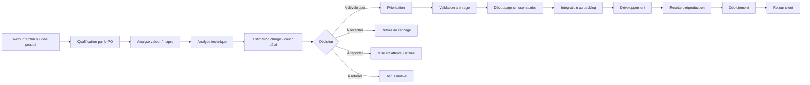
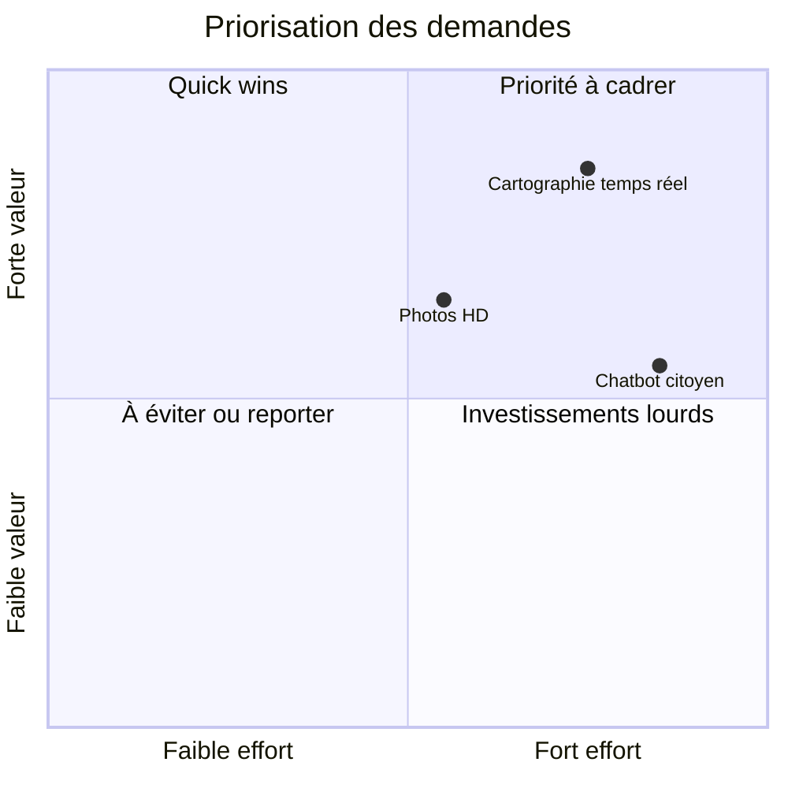

# Partie 4 — Gestion produit, évolutions et priorisation

## 1. Objectif de la partie

Cette partie présente la façon dont GreenCity Tech peut organiser sa gestion produit et piloter les nouvelles évolutions fonctionnelles sans désorganiser le projet.

Après avoir défini l'organisation DevOps, la mise en œuvre technique et la stratégie qualité, l'objectif est maintenant de répondre à une question centrale : comment faire évoluer une plateforme destinée à plusieurs collectivités tout en gardant une trajectoire réaliste, maîtrisée et compatible avec les capacités de l'équipe ?

GreenCity Tech fait face à plusieurs enjeux :

- plusieurs collectivités commencent à s'intéresser à la plateforme ;
- le prototype initial doit être stabilisé ;
- les idées d'évolution se multiplient ;
- l'équipe doit éviter d'ajouter des fonctionnalités sans cadrage ;
- chaque évolution peut avoir des impacts techniques, financiers, organisationnels, RGPD ou qualité.

Les demandes mentionnées dans le sujet sont notamment :

- la cartographie temps réel ;
- l'ajout de photos HD ;
- un chatbot citoyen.

L'enjeu n'est donc pas de répondre à des demandes au cas par cas comme dans une logique de prestation classique, mais de mettre en place une méthode de qualification, de priorisation, de chiffrage et de validation à l'échelle d'un produit commun.

---

## 2. Principes de gestion produit

### 2.1. Une gouvernance produit structurée

Les retours des collectivités doivent être structurés afin d'éviter que les idées d'évolution arrivent de façon désordonnée directement auprès des développeurs.

Je proposerais de centraliser les échanges fonctionnels autour du Product Owner.

Le Product Owner joue un rôle d'interface entre :

- les collectivités ;
- la direction de GreenCity Tech ;
- l'équipe de développement ;
- le référent qualité ;
- le profil DevOps senior si la demande a un impact infrastructure ou exploitation.

Cette organisation permet de protéger l'équipe technique des interruptions permanentes, tout en garantissant que les besoins terrain sont bien pris en compte dans une logique de plateforme.

### 2.2. Un canal clair pour les retours et idées d'évolution

Toutes les idées d'évolution, qu'elles viennent d'une collectivité, d'un atelier métier, du support ou de l'équipe produit, doivent être saisies dans un canal identifié : outil projet, formulaire interne, compte rendu d'atelier ou backlog produit.

L'objectif est d'éviter les retours dispersés dans des emails, messages informels ou échanges oraux.

Chaque idée doit au minimum contenir :

- l'origine du besoin ;
- la ou les collectivités concernées ;
- le problème à résoudre ;
- la valeur attendue ;
- le niveau d'urgence perçu ;
- les utilisateurs concernés ;
- les contraintes connues ;
- la date souhaitée si elle existe.

Une évolution ne doit pas être intégrée au planning tant qu'elle n'est pas suffisamment clarifiée et tant que sa pertinence à l'échelle de la plateforme n'est pas comprise.

### 2.3. Des points d'échange réguliers avec les collectivités

Pour maintenir une bonne relation client, je proposerais :

- un point de suivi régulier avec les collectivités pilotes ;
- une démonstration à chaque fin de cycle important ;
- un compte rendu écrit après chaque réunion ;
- un comité de pilotage mensuel pour les arbitrages importants ;
- une validation explicite des fonctionnalités en préproduction.

Cette régularité permet de réduire les incompréhensions, de mieux gérer les attentes et d'alimenter la réflexion produit avec des retours réels d'usage.

---

## 3. Processus de gestion d'une évolution produit

### 3.1. Vue d'ensemble du processus

Une idée d'évolution ne doit pas passer directement de l'idée au développement.

Je proposerais le processus suivant :

Ce processus permet de garder une trace claire des décisions et de limiter les ajouts non maîtrisés dans une plateforme destinée à plusieurs collectivités.

### 3.2. Qualification fonctionnelle

La première étape consiste à comprendre le besoin réel derrière l'idée d'évolution.

Questions à poser :

- quel problème cherche-t-on à résoudre ?
- quel utilisateur est concerné ?
- quelle est la fréquence du besoin ?
- quel bénéfice métier est attendu ?
- existe-t-il une solution plus simple ?
- le besoin concerne-t-il une seule collectivité ou plusieurs ?
- peut-on en faire une fonctionnalité générique utile à la plateforme ?
- est-ce une urgence réelle ou une amélioration souhaitée ?

Cette étape est importante, car une demande exprimée sous forme de solution peut parfois cacher un besoin plus simple, ou un besoin trop spécifique pour devenir une vraie évolution produit.

Exemple : une collectivité peut demander une cartographie temps réel, alors que son besoin principal est peut-être simplement de mieux visualiser les signalements récents.

### 3.3. Analyse technique

Une fois la demande clarifiée, l'équipe technique doit analyser les impacts :

- impact frontend ;
- impact mobile ;
- impact backend ;
- impact base de données ;
- impact API partenaires ;
- impact infrastructure ;
- impact performance ;
- impact sécurité ;
- impact RGPD ;
- impact supervision et logs ;
- impact tests et recette.

Cette analyse évite de sous-estimer des fonctionnalités qui semblent simples côté utilisateur mais lourdes techniquement.

### 3.4. Estimation et arbitrage

Chaque évolution envisagée doit être estimée avant intégration au backlog priorisé.

L'estimation peut porter sur :

- la charge de développement ;
- la charge de test ;
- la charge DevOps / infrastructure ;
- le coût d'exploitation ;
- les risques associés ;
- le délai de livraison ;
- la dette technique éventuelle ;
- les dépendances avec d'autres sujets.

Le coût doit être compris au sens large, et pas seulement comme un temps de développement initial. Il peut aussi inclure :

- le stockage supplémentaire ;
- le trafic réseau ;
- l'augmentation des sauvegardes ;
- le besoin de supervision complémentaire ;
- le coût de support ;
- le coût de maintenance dans le temps ;
- le besoin éventuel de modération ou de traitement manuel.

Le Product Owner arbitre ensuite avec la direction et, selon la nature de l'évolution, avec l'appui :

- du **DevOps senior** si la demande a un impact sur l'infrastructure, les coûts techniques, la sécurité des déploiements ou l'exploitation ;
- du **référent qualité** si la demande a un impact fort sur les tests, la recette, l'accessibilité ou les critères de validation ;
- de la **collectivité concernée** s'il faut mieux comprendre le besoin terrain ou ajuster le périmètre.

L'objectif n'est pas seulement d'éviter de promettre une fonctionnalité sans connaître son coût réel. Il s'agit aussi d'éviter d'intégrer dans le produit commun une demande trop locale, trop coûteuse ou trop risquée au regard du bénéfice global attendu.

Cette gouvernance permet de garder le Product Owner comme point d'entrée principal, tout en évitant qu'une décision structurante soit prise sans tenir compte de ses impacts techniques, qualité ou exploitation.

---

## 4. Priorisation des évolutions

### 4.1. Méthode retenue

Je proposerais une priorisation simple basée sur trois critères :

- valeur métier ;
- effort de réalisation ;
- risque ou urgence.

Cette approche est plus lisible qu'une méthode trop complexe. Elle peut être complétée par une méthode MoSCoW pour classer les demandes.

La priorisation ne dépend cependant pas uniquement de la valeur théorique d'une demande. Elle doit aussi tenir compte :

- de la capacité réelle de l'équipe sur la période ;
- des travaux de stabilisation déjà engagés ;
- des incidents ou urgences de production ;
- des prérequis techniques non encore traités ;
- du niveau de risque acceptable.

Une évolution peut donc être jugée intéressante sans pour autant être planifiée immédiatement, si le socle existant doit encore être consolidé ou si le besoin reste trop spécifique à un seul contexte local.

### 4.2. Matrice valeur / effort

Cette matrice n'a pas vocation à donner une vérité définitive, mais à faciliter la discussion.

Elle permet de distinguer :

- les quick wins ;
- les sujets à forte valeur mais coûteux ;
- les demandes secondaires ;
- les sujets à reporter.

### 4.3. Méthode MoSCoW

La méthode MoSCoW peut compléter la matrice valeur / effort.

| Catégorie | Signification | Exemple |
|---|---|---|
| Must have | indispensable pour la stabilité ou la valeur principale | fiabiliser la création de signalement |
| Should have | important mais pas bloquant immédiatement | amélioration de la carte existante |
| Could have | utile mais secondaire | options avancées de personnalisation |
| Won't have now | non retenu pour cette phase | chatbot complet sans cadrage RGPD |

Cette méthode aide à expliquer clairement pourquoi certaines évolutions sont intégrées à la roadmap produit et d'autres reportées, recadrées ou non retenues.

---

## 5. Analyse des évolutions principales envisagées

### 5.1. Cartographie temps réel

#### Description

La cartographie temps réel permettrait aux citoyens et aux collectivités de visualiser les signalements sur une carte actualisée rapidement.

#### Valeur métier

Cette demande peut apporter une forte valeur :

- meilleure visibilité des incidents ;
- meilleure compréhension de la situation terrain ;
- suivi plus intuitif pour les agents municipaux ;
- transparence renforcée pour les citoyens ;
- outil utile pour prioriser les interventions.

#### Impacts techniques

Cette fonctionnalité peut avoir plusieurs impacts :

- performance de l'API ;
- requêtes fréquentes sur la base de données ;
- gestion du volume de signalements ;
- besoin éventuel de cache ;
- choix entre rafraîchissement périodique, polling optimisé ou WebSocket ;
- optimisation de l'affichage côté frontend et mobile ;
- gestion de la géolocalisation ;
- filtrage par zone, statut ou catégorie.

#### Risques

- surcharge de l'API si la carte interroge trop souvent le backend ;
- affichage lent sur mobile ;
- exposition de données trop précises ;
- mauvaise gestion des droits entre collectivités ;
- difficulté à garantir du vrai temps réel si l'infrastructure n'est pas prête.

#### Proposition

Je ne proposerais pas de commencer directement par un vrai temps réel complet.

Je proposerais une approche progressive :

1. carte avec rafraîchissement manuel ou périodique ;
2. filtres par zone, statut et catégorie ;
3. optimisation des performances ;
4. cache si nécessaire ;
5. temps réel plus avancé uniquement si le besoin est confirmé.

Cette approche permet de livrer rapidement de la valeur sans créer une complexité technique excessive dès le départ.

### 5.2. Photos HD

#### Description

La fonctionnalité permettrait aux citoyens d'ajouter des photos de meilleure qualité aux signalements.

#### Valeur métier

Les photos HD peuvent aider les agents municipaux à mieux qualifier les incidents :

- meilleure compréhension du problème ;
- meilleure priorisation des interventions ;
- réduction des demandes d'information complémentaires ;
- preuve visuelle plus exploitable.

#### Impacts techniques

Cette évolution a des impacts importants :

- augmentation du volume de stockage ;
- coûts d'hébergement plus élevés ;
- temps d'upload plus long ;
- consommation réseau plus importante ;
- besoin de compression ou redimensionnement ;
- sauvegarde des fichiers ;
- surveillance du stockage ;
- adaptation des limites côté API.

#### Impacts sécurité / RGPD

Les photos peuvent contenir :

- visages ;
- plaques d'immatriculation ;
- lieux privés ;
- métadonnées EXIF ;
- coordonnées GPS ;
- informations non nécessaires au traitement.

Il faut donc prévoir :

- suppression des métadonnées inutiles ;
- limites de taille ;
- règles de conservation ;
- droits d'accès stricts ;
- information utilisateur claire ;
- éventuelle modération en cas d'abus.

#### Proposition

Je proposerais une approche intermédiaire :

- autoriser une meilleure qualité, mais avec limite de poids ;
- compresser automatiquement les images ;
- supprimer les métadonnées sensibles ;
- stocker les fichiers dans un espace dédié ;
- surveiller le volume de stockage ;
- mesurer l'impact sur les performances avant d'augmenter les limites.

Cette approche répond au besoin sans ouvrir immédiatement un risque de coût ou de performance trop important.

### 5.3. Chatbot citoyen

#### Description

Le chatbot citoyen pourrait aider les utilisateurs à :

- comprendre comment faire un signalement ;
- être orientés vers la bonne catégorie ;
- obtenir des informations sur le traitement ;
- réduire certaines demandes au support.

#### Valeur métier

Le chatbot peut apporter de la valeur, mais son utilité dépend fortement de son cadrage.

Bénéfices possibles :

- assistance aux citoyens ;
- réduction des demandes simples ;
- amélioration de l'accessibilité au service ;
- orientation vers les bons parcours ;
- support disponible en continu.

#### Impacts techniques

Le chatbot peut avoir des impacts importants :

- choix de solution technique ;
- intégration avec le portail et l'application mobile ;
- accès éventuel aux données utilisateur ;
- journalisation des conversations ;
- supervision des erreurs ;
- modération des réponses ;
- coûts d'usage ;
- sécurité des données envoyées au modèle.

#### Risques

- réponses incorrectes ;
- mauvaise orientation des citoyens ;
- traitement de données personnelles ;
- manque de contrôle sur les réponses ;
- coût variable ;
- difficulté à expliquer le fonctionnement aux collectivités ;
- risque d'introduire une fonctionnalité visible mais insuffisamment fiable.

#### Proposition

Je proposerais de ne pas démarrer par un chatbot complexe connecté à toutes les données.

Approche progressive :

1. FAQ guidée ou assistant simple basé sur des questions fréquentes ;
2. chatbot limité aux informations générales ;
3. analyse des usages et des questions récurrentes ;
4. intégration progressive avec les données de signalement si le cadre RGPD et sécurité est validé ;
5. supervision des réponses et possibilité de remontée vers un humain.

Cette approche limite le risque tout en permettant de tester la valeur réelle du chatbot.

---

## 6. Backlog cible des évolutions

### 6.1. Découpage en lots

Les évolutions doivent être découpées en lots pour éviter les gros tunnels de développement.

| Lot | Contenu | Objectif |
|---|---|---|
| Lot 1 | Stabilisation des parcours existants | réduire les bugs et sécuriser le socle |
| Lot 2 | Amélioration cartographie simple | apporter de la visibilité sans vrai temps réel complet |
| Lot 3 | Photos améliorées avec limites | améliorer la qualité sans exploser les coûts |
| Lot 4 | Assistant citoyen simple | tester la valeur du chatbot sans risque élevé |
| Lot 5 | Cartographie plus dynamique | aller vers plus de temps réel si le besoin est confirmé |
| Lot 6 | Chatbot plus intégré | connecter davantage aux données si le cadre est validé |

Cette logique par lots permet de garder une trajectoire progressive.

Elle permet aussi de préserver de la capacité pour les sujets transverses déjà identifiés dans les parties précédentes :

- stabilisation du produit ;
- amélioration de la qualité ;
- sécurisation des déploiements ;
- supervision ;
- conformité et accessibilité.

### 6.2. Exemple de backlog priorisé

| Priorité | Évolution | Justification |
|---|---|---|
| P0 | Stabiliser création et traitement des signalements | fonction principale du produit |
| P0 | Fiabiliser upload photo actuel | nécessaire avant photos HD |
| P1 | Améliorer affichage cartographique existant | forte valeur métier |
| P1 | Ajouter compression et contrôle de taille image | prérequis aux photos HD |
| P2 | Mettre en place une FAQ guidée | première étape chatbot maîtrisée |
| P2 | Ajouter rafraîchissement automatique de la carte | étape intermédiaire vers temps réel |
| P3 | Chatbot connecté aux données utilisateur | à cadrer après analyse RGPD et sécurité |
| P3 | Temps réel avancé | à faire si volumétrie et besoin confirmés |

Ce backlog montre que les nouvelles demandes ne sont pas rejetées, mais intégrées dans une trajectoire maîtrisée.

---

## 7. Gestion du changement et communication

### 7.1. Communication avec les collectivités

Les collectivités doivent comprendre ce qui est livré, ce qui est en cours et ce qui est reporté, mais aussi que les décisions sont prises dans une logique de plateforme commune et non d'adaptation spécifique systématique.

Je proposerais :

- une roadmap partagée ;
- des comptes rendus de décision ;
- des démonstrations régulières ;
- des notes de version simples ;
- un suivi des demandes ouvertes ;
- une distinction claire entre anomalie, amélioration et nouvelle fonctionnalité.

Cette transparence permet de maintenir la confiance même quand certaines idées ne sont pas retenues immédiatement.

### 7.2. Gestion des attentes

Le risque principal est de promettre trop vite des fonctionnalités visibles mais coûteuses.

Il faut donc expliquer clairement :

- ce qui est réalisable rapidement ;
- ce qui nécessite une phase de cadrage ;
- ce qui implique des coûts d'exploitation ;
- ce qui soulève des risques RGPD ;
- ce qui dépend de la stabilisation du socle existant.

Phrase importante :

> Une évolution ne doit pas être évaluée uniquement sur sa valeur visible pour une collectivité, mais aussi sur son intérêt à l'échelle de la plateforme, son coût de maintenance, son impact sécurité, son impact performance et sa compatibilité avec l'état actuel du produit.

### 7.3. Retour utilisateur

Il faut également organiser la collecte des retours utilisateurs :

- retours des collectivités ;
- retours des agents municipaux ;
- retours citoyens ;
- statistiques d'usage ;
- support ou tickets ;
- incidents remontés en production.

Ces retours permettent d'ajuster le backlog sur la base d'éléments concrets plutôt que sur des suppositions.

---

## 8. Indicateurs de pilotage client et produit

Les indicateurs doivent aider à suivre la relation client et l'efficacité des évolutions.

Il est utile de distinguer :

- les indicateurs suivis en permanence pour piloter la relation client et le produit ;
- les indicateurs plus spécifiques, suivis seulement lorsque certaines évolutions ont réellement été mises en service.

### 8.1. Indicateurs de relation client

- satisfaction des collectivités ;
- nombre de demandes ouvertes ;
- délai moyen de qualification d'une demande ;
- délai moyen de traitement d'une demande validée ;
- nombre de demandes livrées par période ;
- nombre de demandes reportées avec justification.

### 8.2. Indicateurs produit

- nombre de signalements créés ;
- taux de signalements avec photo ;
- taux d'échec d'upload photo ;
- usage de la carte ;
- temps moyen de traitement d'un signalement ;
- taux de signalements clôturés ;
- taux d'abandon pendant la création d'un signalement.

Ces indicateurs constituent le socle de pilotage régulier. Ils permettent déjà de voir si la relation client est fluide et si le produit progresse dans le bon sens.

### 8.3. Indicateurs d'adoption des nouvelles fonctionnalités

Pour les évolutions futures, certains indicateurs ne deviennent utiles qu'après la mise en service effective de la fonctionnalité concernée :

- usage de la cartographie ;
- nombre de photos HD envoyées ;
- volume de stockage consommé ;
- temps moyen d'upload photo ;
- nombre d'interactions chatbot ;
- taux de résolution ou d'orientation du chatbot ;
- taux d'escalade vers un humain.

Ces indicateurs permettent de vérifier si les demandes livrées apportent réellement de la valeur.

---

## 9. Justification globale des choix

La stratégie proposée vise à éviter deux erreurs :

- accepter toutes les idées d'évolution sans analyse, au risque de fragiliser davantage le produit ;
- traiter la plateforme comme une succession de demandes spécifiques, au risque de perdre la cohérence produit.

La bonne approche consiste à cadrer, prioriser, estimer et intégrer progressivement les évolutions dans une logique de produit mutualisé.

Les demandes de cartographie temps réel, de photos HD et de chatbot sont pertinentes, mais elles ne doivent pas être traitées comme de simples ajouts d'interface. Elles ont des impacts techniques, financiers, RGPD, qualité et exploitation.

En structurant la remontée des besoins autour du Product Owner, d'un backlog priorisé, de points réguliers et d'une méthode d'arbitrage claire, GreenCity Tech peut continuer à faire évoluer sa plateforme sans perdre le contrôle de sa trajectoire.

---

## 10. Points d'appui pour la suite

Les points les plus importants à réutiliser ensuite seront :

- les demandes client doivent être centralisées et qualifiées ;
- le Product Owner protège l'équipe tout en représentant la valeur métier ;
- chaque évolution doit être analysée sous l'angle valeur, effort, risque et coût d'exploitation ;
- les demandes visibles comme la cartographie, les photos HD ou le chatbot peuvent avoir des impacts techniques importants ;
- la priorisation doit être transparente pour maintenir la confiance client ;
- les évolutions doivent être découpées en lots progressifs ;
- les indicateurs produit permettent de vérifier la valeur réelle après livraison.

La logique générale à conserver est la suivante : GreenCity Tech ne doit pas seulement livrer plus de fonctionnalités, mais livrer les bonnes fonctionnalités, au bon moment, avec un niveau de risque maîtrisé.
